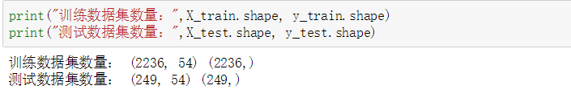

## CourseEA

### 1.介绍

#### 1.1 简介

主要用来做情感分析的数据处理库
可处理csv文件，若是其他文件可再CPreprocess修改相应代码
PS：需要下载embeddings预训练模型，下载链接：https://pan.baidu.com/s/1ezIH5MK2oYqx-6hocm1Bww&shfl=sharepset 提取码：z1ly 
下载完放在和CourseEA同个目录

#### 1.2 支持数据格式
支持数据格式：[username, comment, star, pos | neg]
即[用户名，评论，打星数，积极消极标注]

#### 1.3 适用范围

可用在各种评论处理业务，如豆瓣评论，课程评论，新闻评论，甚至是短文本等等，可用此库转化为词向量，再进行训练

#### 1.4 environment（使用环境）

1. python 3.x
2. csv bz2 re
3. numpy matplotlib  
4. jieba gensim
5. tensorflow 1.14.0

### 2. CPreprocess的使用

2.1 File

定义存放数据集（未处理）文件的目录，可调用**get_files**函数获取该目录下所有文件的路径和文件名列表

    > from CourseEA.CPreprocess import File
    > file = File("dataset/result/")
    > files_dir_list = file.get_files_dir_list()
    > files_name_list = file.get_files_name_list()

2.2 Data
接收所有数据集文件的路径，可进行获取数据集和查看数据分布情况

    > from CourseEA.CPreprocess import Data
    > dt = Data(files_dir_list)
    > dataset = dt.get_dataset()
    > dt.get_dataset_shape()
    > dt.get_dataset_distribution()

### 3. DataPreprocess的使用

3.1 DataProcess

将评论清洗完转化为词向量，可直接进行训练

3.1.1 初始化DataProcess类和加载预训练模型

    > from CourseEA.DataPreProcess import DataProcess
    > dataProcess = DataProcess(dataset) # 这里的dataset是上面2.2 Data类获得的数据集
    > cn_model = dataProcess.get_cn_model()
    
3.1.2 提取训练数据集和标签数据集

    > train_texts_origin, train_score, train_target = dataProcess.process()

3.1.3 查看数据分布情况

    > num_tokens = dataProcess.get_tokens_num_and_distribution(train_tokens)
  num_tokens是所有tokens的长度
    
 
3.1.4 获取填充后的训练数据和词嵌入矩阵（在放入keras训练的时候用到）

    > train_pad = dataProcess.tokens_process(train_tokens, num_tokens)
    使用正太分布3δ法则可覆盖 0.9859154929577465
    > embedding_matrix = dataProcess.get_embedding_matrix()

3.1.5 进行训练和测试样本的分割
    
    > from sklearn.model_selection import train_test_split
    > X_train, X_test, y_train, y_test = train_test_split(train_pad,
                                                    train_target,
                                                    test_size=0.1,
                                                    random_state=12)
             

3.1.6 查看训练样本，确认无误
    
    > print(dataProcess.reverse_tokens(X_train[1]))
    > print('class: ',y_train[1])
                                
    